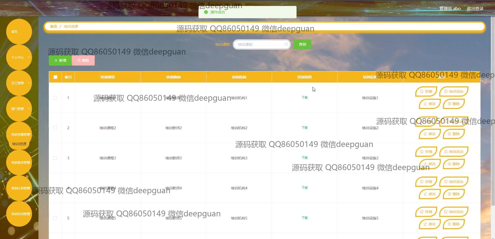

<h1 align="center">企业员工岗前培训管理系统+vue</h1>

## 简介
企业员工岗前培训管理系统：角色分为管理员、用户；功能涵盖员工信息管理、培训计划与活动管理、需求登记与审核、资源下载与修改等，支持多模块导航与操作。    --计算机毕业设计源码；毕设源码；java毕业设计源码

## 联系方式

<h3 align="center">获取完整代码与数据库文件 + 微信：deepguan QQ: 86050149 QQ群: 783742310</h3>

<h3 align="center">可帮忙远程部署 包运行成功！提供远程部署、修改代码、设计文档指导、代码讲解等服务！</h3>

## 功能介绍（完整见运行截图）
管理员：管理员可以通过系统进行员工管理、部门管理、培训资源和活动管理。可以访问个人中心以修改个人信息和密码。系统提供了员工信息管理功能，包括增加、编辑、删除等操作，支持上传员工头像及查询功能。管理员还可以管理和审核员工培训需求，并制定培训计划与方案，确保企业培训工作的有效进行。系统为管理员提供了简洁直观的导航菜单，便于操作和管理各种功能模块。

员工：员工可以通过系统进行信息注册和登录，访问个人中心查看和修改个人信息。系统帮助员工管理自己的培训需求，包括登记和更新需求原因。员工可以查看培训课程列表、培训计划和培训活动，对课程的地点、学时、教师、时间等信息进行查看，并根据需要参与培训。员工还能够通过系统接收到培训的相关通知和安排，便于及时参与到企业的培训活动中去。

培训人员：培训人员通过系统管理并分配培训任务，制定培训计划，并对培训资源进行整理与编辑。可以查看培训课程的详细信息，包括课程内容、培训教师、授课机构、设备需求等，并进行相应的修改和更新。培训人员负责审核员工的培训需求，根据实际需求设计合理的培训方案，并通过系统提交和管理具体的培训活动及时间安排，确保员工技能的有效提升。

## 运行截图

本代码来源于网络,仅供学习参考使用!

